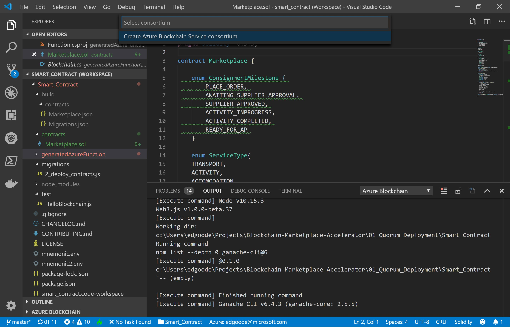

# Quorum
This folder contains the resources needed to deploy a smart contract using the [Azure Blockchain Development Kit](https://marketplace.visualstudio.com/items?itemName=AzBlockchain.azure-blockchain). First, you must deploy an Azure Blockchain Service network. This can either be done in the Azure Portal or using the development kit.

## Prerequisites
1. [Azure Account](https://azure.microsoft.com/en-us/)
2. [Visual Studio Code](https://code.visualstudio.com/)
3. [Azure Blockchain Development Kit](https://marketplace.visualstudio.com/items?itemName=AzBlockchain.azure-blockchain)

## Setup Options
- **Azure Portal**
- **Azure Blockchain Development Kit**

### Azure Blockchain Development Kit Instructions
1. Open the Smart Contract workspace in Visual Studio Code
2. Install the Azure Blockchain Development Kit Extenstion
3. Open the command pallette (ctr + shift + p) and type "Azure Blockchain: Create Azure Blockchain Service"
4. Follow the prompts until the service is created

### Smart Contract Installation Instructions
1. Right click on the Marketplace.sol Smart Contract
2. Select 'Deploy Contract'
3. Follow steps to deploy to your newly created network
4. Save the Smart Contract addressed from the output this will be needed for your application

### References
For additional guidance, check the [Dev Kit Wiki](https://github.com/Microsoft/vscode-azure-blockchain-ethereum/wiki).