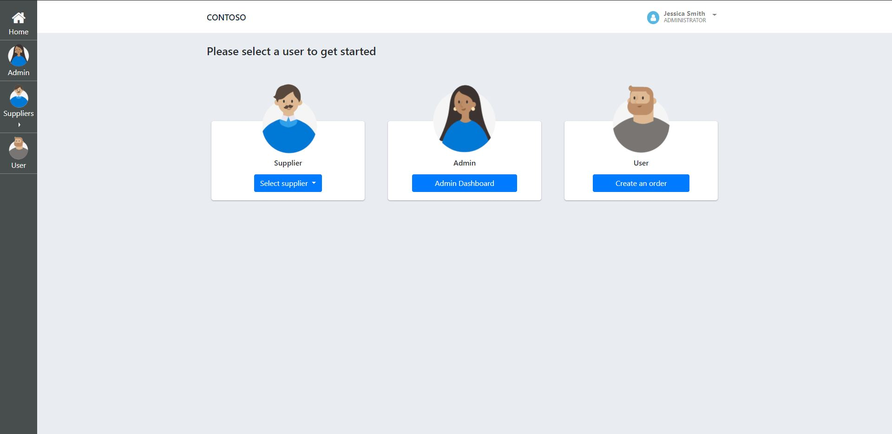
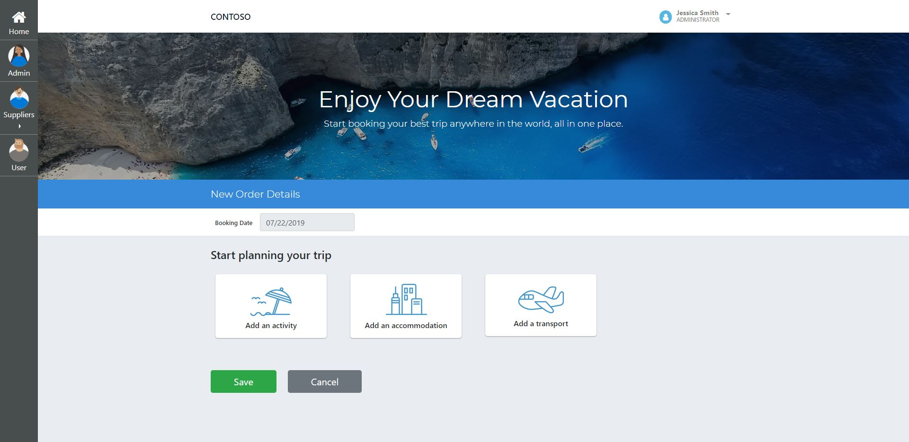
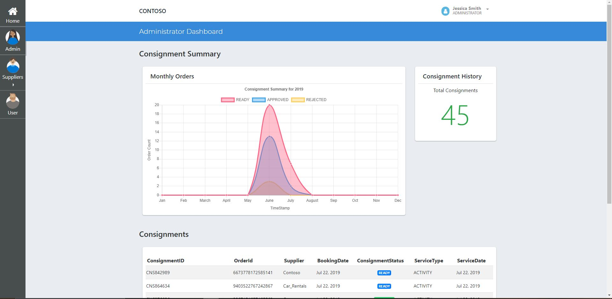
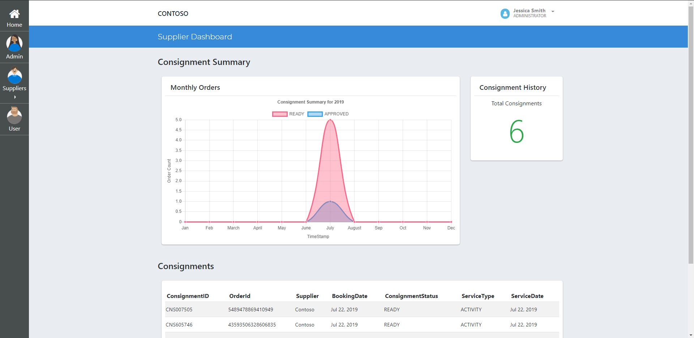

# Application Deployment
After following all previous steps, you will have a resource group containing CosmosDB and a running ABS org/node.

There are a few modifications to the [Marketplace Solution](./src/Marketplace.sln) that need to be made to work with your infrastructure. The connection strings need to be updated for the Cosmos account. Additionally, you will need to update the rpc endpoint and smart contract address for your Quorum service.

## Prerequisites
1. [Service Fabric](https://docs.microsoft.com/en-us/azure/service-fabric/service-fabric-get-started)
2. [Visual Studio](https://visualstudio.microsoft.com/)
3. Updated connection strings

## Options
You can either run the application locally or hosted using Service Fabric in your resource group. To run in Azure follow the guid to [deploying a service fabric .net application](https://docs.microsoft.com/en-us/azure/service-fabric/service-fabric-tutorial-deploy-app-to-party-cluster)

# Steps
1. Open [Healthcare.sln](./src/Healthcare.sln) in Visual Studio (as Admin)
2. Replace the values in (./src/Marketplace.BC.Quorum/Marketplace.BC.Quorum.Service/SmartContract.cs) with your ABS endpoint and contract address
3. Replace the "MongoConnectionString" with your Cosmos' connection string in (02_Application_Deployment\src\Marketplace.APIService\appsettings.json)
3. Build Project
4. Run the Service Fabric Apphosting project
5. Go to http://localhost:8080 to use the application

## Components
This project contains a number of components described below.

| Resource              | Usage                                                                                     |
|-----------------------|-------------------------------------------------------------------------------------------|
| Indexer Service  | Stores each blockchain transaction in the MongoDB store|                                                     |
| Quorum Client               | Sends requests to the smart contract                                                    |
| API Service               | Consolidates all requests to a single interface for the UI                                                    |
| WebApp               | The Angular application                                                    |

 # Using the Application

## Main Page

To create a new trip, select the user view.

## Book a Trip

To book a trip and add components to the trip, select the options provided.

## Admin Trips

To view all trips, select the admin view.

## Supplier View

To view specific supplier trips, select the supplier view.

## Admin Trips

To view all trips, select the admin view.

