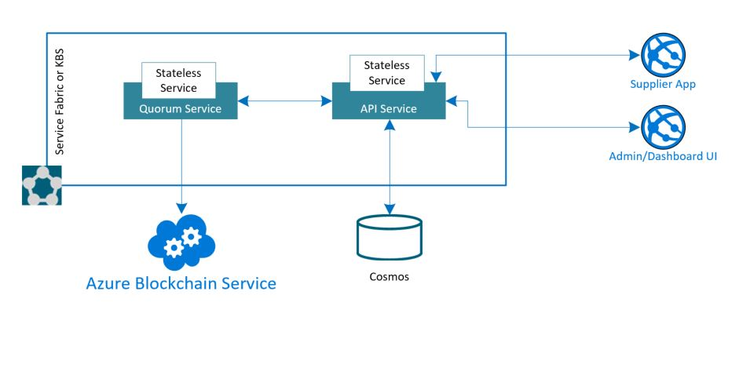

# Blockchain Marketplace Accelerator

## Working Documentation - Updates in Progress
> This repository and documentation is a work in progress. Updates and improvements are ongoing.

## About this repository
This accelerator was built to provide developers with all of the resources needed to quickly build an initial [Azure Blockchain Service](https://azure.microsoft.com/en-us/services/blockchain-service/) Marketplace solution. Use this accelerator to jump start your development efforts with Blockchain and Azure.

This repository contains the steps, scripts, code, and tools to create a Quorum network and application. 00_Resource_Deployment will create the necessary supporting resources in Azure (Cosmos DB). 01_Quorum_Deployment will walk you through deploying an Azure Blockchain Service network, and once deployed, it will help you configure and deploy a marketplace smart contract on the network. Finally, 03_Application_Deployment will deploy and host your application locally or in your subscription.

## Prerequisites
In order to successfully complete your solution, you will need to have access to and or provisioned the following:
1. Access to an Azure subscription
2. Visual Studio 2017 or 2019
3. Visual Studio Code

## Azure and Blockchain
The directions provided for this repository assume fundemental working knowledge of Azure Blockchain Service, Cosmos DB, Quoruom (Ethereum), and Service Fabric

For additional training and support, please see:
 1. [Azure Blockchain Service](https://azure.microsoft.com/en-us/services/blockchain-service/)
 2. [Quorum](https://www.goquorum.com/)
 3. [Cosmos DB](https://docs.microsoft.com/en-us/azure/cosmos-db/introduction)
 4. [Service Fabric](https://azure.microsoft.com/en-us/services/service-fabric/)

## Architecture

## Getting Started and Process Overview
Clone/download this repo onto your computer and then walk through each of these folders in order, following the steps outlined in each of the README files.

### [00 - Resource Deployment](./00_Resource_Deployment)
The resources in this folder can be used to deploy the required resources into your Azure Subscription. This can be done either via the [Azure Portal](https://portal.azure.com) or by using the [PowerShell script](./00_Resource_Deployment/deploy.ps1) included in the resource deployment folder.

After running the script, you will have a Cosmos DB account with necessary databases and collections for the application.

### [01 - Quorum Deployment](./01_Quorum_Deployment)
This folder contains the Smart Contract and deployment information for the Quorum network on Azure Blockchain Service. To get started review the Azure Blockchain Service documentation. At this time, automated deployments are not available. Please follow the steps in the accompanying [README](./02_Application_Deployment/README.md) to deploy the network and smart contract.

After completing this section you will have a smart contract deployed at the specied address. The client described below below will use this address to execute the smart contract functions. 

### [02 - Application Deployment](./02_Application_Deployment)
This folder contains the .net services for executing the smart contract, tracking transactions using MongoDB, and serving client requests. The Angular web application is also started and hosted with these services. Service Fabric is used to host this application.

## Resources
> A hosted version of the application can be found [here](http://blockchain-marketplace.eastus.cloudapp.azure.com/), and the video walkthrough can be watched [here.](https://msit.microsoftstream.com/video/ec116de1-8bfc-4858-976e-57d087773fd0)

## License
Copyright (c) Microsoft Corporation

All rights reserved.

MIT License

Permission is hereby granted, free of charge, to any person obtaining a copy of this software and associated documentation files (the ""Software""), to deal in the Software without restriction, including without limitation the rights to use, copy, modify, merge, publish, distribute, sublicense, and/or sell copies of the Software, and to permit persons to whom the Software is furnished to do so, subject to the following conditions:

The above copyright notice and this permission notice shall be included in all copies or substantial portions of the Software.

THE SOFTWARE IS PROVIDED AS IS, WITHOUT WARRANTY OF ANY KIND, EXPRESS OR IMPLIED, INCLUDING BUT NOT LIMITED TO THE WARRANTIES OF MERCHANTABILITY, FITNESS FOR A PARTICULAR PURPOSE AND NONINFRINGEMENT. IN NO EVENT SHALL THE AUTHORS OR COPYRIGHT HOLDERS BE LIABLE FOR ANY CLAIM, DAMAGES OR OTHER LIABILITY, WHETHER IN AN ACTION OF CONTRACT, TORT OR OTHERWISE, ARISING FROM, OUT OF OR IN CONNECTION WITH THE SOFTWARE OR THE USE OR OTHER DEALINGS IN THE SOFTWARE

## Contributing

This project welcomes contributions and suggestions.  Most contributions require you to agree to a
Contributor License Agreement (CLA) declaring that you have the right to, and actually do, grant us
the rights to use your contribution. For details, visit https://cla.microsoft.com.

When you submit a pull request, a CLA-bot will automatically determine whether you need to provide
a CLA and decorate the PR appropriately (e.g., label, comment). Simply follow the instructions
provided by the bot. You will only need to do this once across all repos using our CLA.

This project has adopted the [Microsoft Open Source Code of Conduct](https://opensource.microsoft.com/codeofconduct/).
For more information see the [Code of Conduct FAQ](https://opensource.microsoft.com/codeofconduct/faq/) or
contact [opencode@microsoft.com](mailto:opencode@microsoft.com) with any additional questions or comments.
